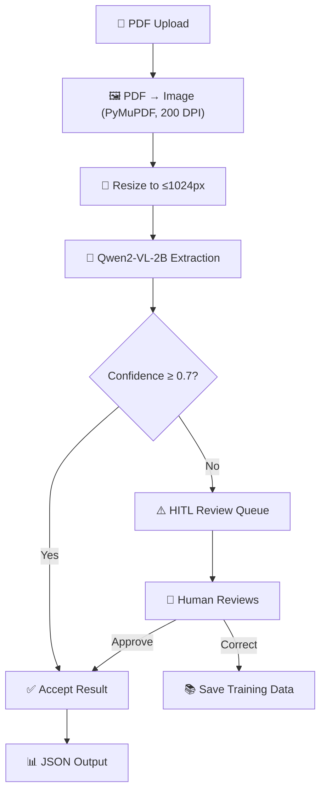
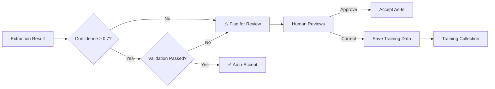
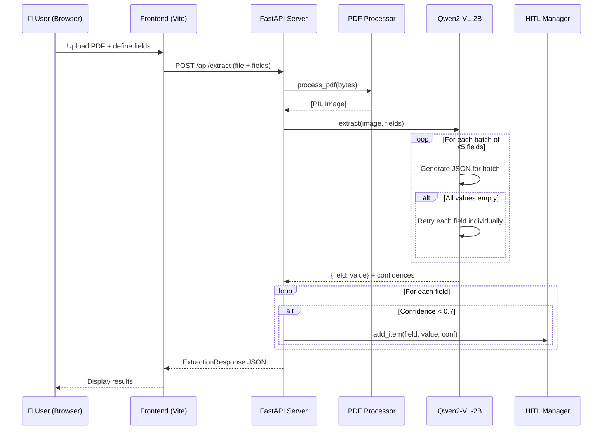
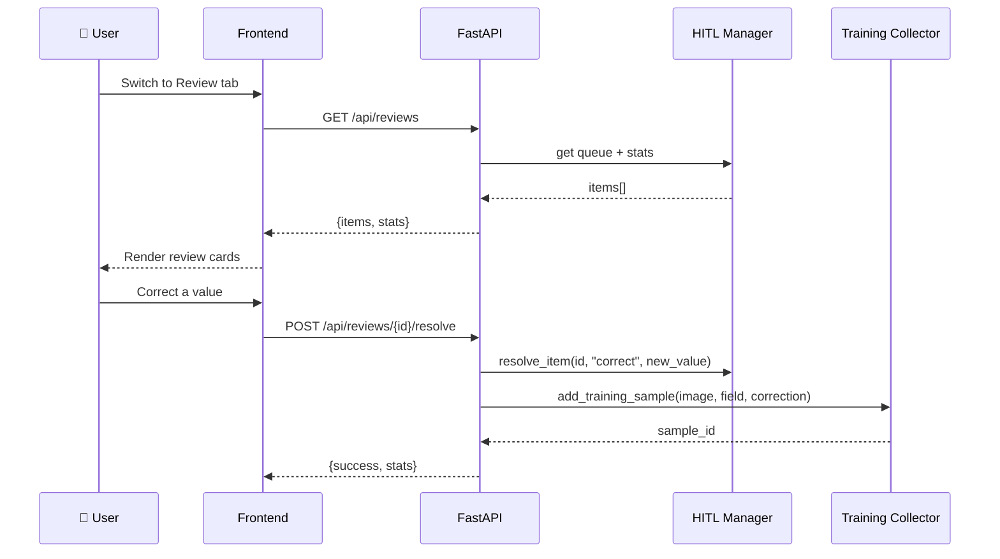

# Software Requirements Specification (SRS)

## PDF AI — Intelligent Document Extraction System

| Field               | Value                                            |
| :------------------ | :----------------------------------------------- |
| **Project**         | PDF AI                                           |
| **Version**         | 4.2                                              |
| **Date**            | February 2026                                    |
| **Author**          | Dhairya                                          |
| **Hardware Target** | Multi-GPU (auto-selects best model per hardware) |
| **Budget**          | ₹0 — All models local, no paid APIs              |

---

## Table of Contents

1. [Introduction](#1-introduction)
2. [Overall Description](#2-overall-description)
3. [System Architecture](#3-system-architecture)
4. [Qwen VL Extraction Subsystem](#4-qwen-vl-extraction-subsystem)
5. [PDF Processing Subsystem](#5-pdf-processing-subsystem)
6. [Field Detection Subsystem](#6-field-detection-subsystem)
7. [Field Validation Subsystem](#7-field-validation-subsystem)
8. [HITL Review Subsystem](#8-hitl-review-subsystem)
9. [Training Data Collection Subsystem](#9-training-data-collection-subsystem)
10. [Frontend UI Requirements](#10-frontend-ui-requirements)
11. [API Specification](#11-api-specification)
12. [Data Flow Diagrams](#12-data-flow-diagrams)
13. [Non-Functional Requirements](#13-non-functional-requirements)
14. [Hardware & VRAM Budget](#14-hardware--vram-budget)
15. [Error Handling & Recovery](#15-error-handling--recovery)
16. [Deployment & Installation](#16-deployment--installation)
17. [Configuration Reference](#17-configuration-reference)
18. [File Structure Reference](#18-file-structure-reference)
19. [Limitations & Known Constraints](#19-limitations--known-constraints)
20. [Future Improvements](#20-future-improvements)
21. [Glossary](#21-glossary)

---

## 1. Introduction

### 1.1 Purpose

This SRS defines the complete functional and non-functional requirements for the PDF AI system — an intelligent document extraction tool that converts unstructured PDF forms into structured JSON data using a **single Vision-Language Model (Qwen VL)**. The system **auto-selects the best model** for the available GPU VRAM. It is fully local, requires no cloud APIs, and runs on commodity hardware.

### 1.2 Scope

The system provides:

- **A Vision-Language Model (Qwen2-VL-2B)** that reads document images directly — no OCR pipeline needed.
- **Automatic field detection** — the model visually scans the document and identifies all extractable fields.
- **Batched multi-field extraction** — extracts up to 5 fields per inference pass with automatic retry for failed batches.
- **A HITL (Human-In-The-Loop) Review Queue** for human validation and correction of low-confidence results.
- **A Training Data Collector** that accumulates human corrections for future model fine-tuning.
- **A Web Frontend** for uploading PDFs, managing fields, viewing results, and reviewing flagged extractions.

### 1.3 What This System Does NOT Include

The following were deliberately removed during the v4.0 restructure and are documented in [`MODELS_REFERENCE.md`](file:///e:/Dhairya/0_Projects/PDF%20AI/MODELS_REFERENCE.md):

| Removed Component                   | Reason                                          |
| :---------------------------------- | :---------------------------------------------- |
| PaddleOCR, Surya OCR                | Qwen2-VL reads pixels directly — no OCR needed  |
| LayoutLMv3, UDOP-large              | Replaced by Qwen2-VL which has higher accuracy  |
| Image preprocessor (deskew/denoise) | No OCR means preprocessing has minimal impact   |
| Field classifier (rule-based)       | VLM-based detection via prompt is more flexible |
| LayoutLMv3 fine-tuning script       | Removed with LayoutLMv3 model                   |

### 1.4 Intended Audience

| Audience           | Interest                                     |
| :----------------- | :------------------------------------------- |
| Developer (Intern) | Full implementation reference                |
| Project Supervisor | Architecture decisions, accuracy targets     |
| Future Maintainers | System boundaries, data flows, API contracts |

### 1.5 Definitions & Abbreviations

| Term       | Definition                                                                     |
| :--------- | :----------------------------------------------------------------------------- |
| **ANLS**   | Average Normalised Levenshtein Similarity — standard DocVQA accuracy metric    |
| **DocVQA** | Document Visual Question Answering — answering questions about document images |
| **HITL**   | Human-In-The-Loop — manual review/correction of AI outputs                     |
| **VLM**    | Vision-Language Model — multimodal model that reads images directly            |
| **VRAM**   | Video RAM — GPU memory available for model loading and inference               |
| **NF4**    | Normal Float 4-bit — quantization format used by BitsAndBytes                  |
| **LoRA**   | Low-Rank Adaptation — efficient model fine-tuning technique                    |

### 1.6 References

| Document              | Location                                                                            |
| :-------------------- | :---------------------------------------------------------------------------------- |
| Models Reference      | [`MODELS_REFERENCE.md`](file:///e:/Dhairya/0_Projects/PDF%20AI/MODELS_REFERENCE.md) |
| Setup Guide           | [`Doc/setup.md`](file:///e:/Dhairya/0_Projects/PDF%20AI/Doc/setup.md)               |
| Model Comparison      | [`Doc/Qwen.md`](file:///e:/Dhairya/0_Projects/PDF%20AI/Doc/Qwen.md)                 |
| DocQA Pipeline Report | `Doc/DocQA_Pipeline_Report.docx`                                                    |

---

## 2. Overall Description

### 2.1 Product Perspective

PDF AI is a standalone, local-only application. It runs entirely on the user's workstation with **no cloud dependencies**. The system **auto-selects the best Qwen VL model** for the available GPU VRAM, using 4-bit quantization to run on hardware from 4GB to 8GB+ VRAM.

### 2.2 Product Functions (High-Level)

The system follows a simple 4-step pipeline:

```
PDF Upload → Image Rendering → Qwen2-VL Extraction → Structured JSON
```

Detailed functions:

1. **Upload** — Accept PDF files via web UI (drag & drop or file picker).
2. **Render** — Convert PDF pages to images at 200 DPI using PyMuPDF.
3. **Detect** — Optionally auto-detect all field labels in the document using VLM.
4. **Extract** — Extract specified field values using auto-selected Qwen VL model (OCR-free).
5. **Validate** — Apply type-specific validation rules (dates, phones, emails, names).
6. **Review** — Route low-confidence (<0.7) results to HITL review queue.
7. **Collect** — Save human corrections as training data for future fine-tuning.
8. **Export** — Return structured JSON with field names, values, and metadata.

### 2.3 User Classes

| User         | Role                                              |
| :----------- | :------------------------------------------------ |
| **Operator** | Uploads PDFs, defines fields, reviews extractions |

### 2.4 Operating Environment

| Component   | Requirement                              |
| :---------- | :--------------------------------------- |
| **OS**      | Windows 10/11                            |
| **GPU**     | NVIDIA GPU with ≥4GB VRAM (CUDA-capable) |
| **CPU**     | Intel i7 or equivalent                   |
| **RAM**     | 16GB minimum, 32GB recommended           |
| **Python**  | 3.10+                                    |
| **Node.js** | 18+                                      |
| **CUDA**    | 11.8+ with cuDNN                         |
| **Browser** | Chrome/Edge (modern)                     |

### 2.5 Constraints

| Constraint            | Detail                                                    |
| :-------------------- | :-------------------------------------------------------- |
| **Zero budget**       | No paid APIs (OpenAI, Google, AWS), no cloud compute      |
| **Local-only**        | All inference on local GPU                                |
| **VRAM limit**        | 4GB total — model must use quantization                   |
| **Single-page focus** | Primary support for single-page forms (multi-page future) |
| **PDF only**          | Only `.pdf` files accepted, max 10MB per file             |

---

## 3. System Architecture

### 3.1 High-Level Architecture Diagram



### 3.2 Component Overview

| Component              | File                                  | Purpose                                           |
| :--------------------- | :------------------------------------ | :------------------------------------------------ |
| **FastAPI Server**     | `backend/server.py`                   | REST API, orchestration (389 lines)               |
| **Configuration**      | `backend/config.py`                   | Qwen2-VL settings, CORS, limits                   |
| **Qwen2-VL Extractor** | `backend/models/qwen2vl_extractor.py` | VLM inference + auto-detect (~730 lines)          |
| **PDF Processor**      | `backend/utils/pdf_processor.py`      | PDF → Image conversion                            |
| **Field Validators**   | `backend/models/validators.py`        | Type-specific validation (~350 lines, 55 aliases) |
| **HITL Manager**       | `backend/hitl_manager.py`             | Review queue persistence                          |
| **Training Collector** | `backend/training_collector.py`       | Training data aggregation                         |
| **Frontend App**       | `src/index.js`                        | Web UI (Vanilla JS + Vite)                        |
| **API Client**         | `src/services/api/backend.js`         | Frontend ↔ Backend HTTP calls                     |
| **Review Queue UI**    | `src/components/review_queue.js`      | HITL review interface                             |

### 3.3 Technology Stack

| Layer                  | Technology                                      |
| :--------------------- | :---------------------------------------------- |
| **Backend Framework**  | FastAPI (Python 3.10+) with Uvicorn             |
| **AI Model**           | Qwen VL (auto-selected per VRAM — see §4.2)     |
| **Quantization**       | BitsAndBytes 4-bit NF4 with double quantization |
| **PDF Rendering**      | PyMuPDF (fitz)                                  |
| **Image Processing**   | Pillow (PIL)                                    |
| **ML Framework**       | PyTorch 2.x with CUDA                           |
| **Frontend**           | Vanilla JS + Vite dev server                    |
| **Package Management** | pip (Python), npm (JS)                          |

---

## 4. Qwen VL Extraction Subsystem

### 4.1 Overview

The extraction subsystem uses a **Qwen Vision-Language Model (VLM)** from Alibaba Cloud. The system **auto-selects the best model** that fits in the available GPU VRAM. The model reads document images directly — **no OCR pipeline needed**. It processes the raw document image through a vision encoder (ViT), projects it into language space, and generates answers using its LLM decoder.

This eliminates the traditional `OCR → Bridge → DocQA` chain and its error propagation. A single model handles everything: reading text from pixels, understanding layout, and generating structured JSON output.

### 4.2 Auto Model Selection

On startup, `config.py` detects available VRAM and selects the best model:

| VRAM Available | Auto-Selected Model           | Params | DocVQA ANLS | VRAM (4-bit) |
| :------------- | :---------------------------- | :----- | :---------- | :----------- |
| ≥8 GB          | `Qwen/Qwen2.5-VL-7B-Instruct` | 7B     | ~95%        | ~4.5 GB      |
| ≥4 GB          | `Qwen/Qwen2.5-VL-3B-Instruct` | 3B     | ~92%        | ~2.5 GB      |
| <4 GB / CPU    | `Qwen/Qwen2-VL-2B-Instruct`   | 2B     | ~88%        | ~1.5 GB      |

Manual override via environment variable: `QWEN_MODEL="Qwen/Qwen2.5-VL-7B-Instruct"`

### 4.3 Technical Specifications (All Models)

| Property              | Value                                          |
| :-------------------- | :--------------------------------------------- |
| **Architecture**      | ViT vision encoder + Qwen LLM decoder          |
| **Quantization**      | 4-bit NF4 (BitsAndBytes)                       |
| **Context Length**    | 32K tokens                                     |
| **Output Type**       | Generative (free text, JSON-capable)           |
| **Singleton**         | Yes — loaded once, stays in VRAM between calls |
| **HuggingFace Class** | `Qwen2VLForConditionalGeneration`              |
| **Processor Class**   | `AutoProcessor`                                |

### 4.4 Model Loading

The model uses a **singleton pattern** — loaded once on first request and kept in VRAM. The model ID is read from `config.py` (auto-selected):

```python
from config import QWEN2VL_MODEL  # Auto-selected based on VRAM

# 4-bit NF4 quantization config
quantization_config = BitsAndBytesConfig(
    load_in_4bit=True,
    bnb_4bit_compute_dtype=torch.float16,
    bnb_4bit_quant_type="nf4",
    bnb_4bit_use_double_quant=True,       # nested quantization saves ~0.4GB
    llm_int8_enable_fp32_cpu_offload=True, # CPU offload for overflow
)

model = Qwen2VLForConditionalGeneration.from_pretrained(
    QWEN2VL_MODEL,  # e.g. "Qwen/Qwen2.5-VL-3B-Instruct"
    quantization_config=quantization_config,
    device_map="auto",
    torch_dtype=torch.float16,
)
model.eval()  # inference-only mode
```

> **Important**: The model MUST NOT be unloaded between requests. Reloading quantized models triggers a bitsandbytes bug. The singleton is kept cached for the lifetime of the server process.

### 4.5 Extraction Prompt

The model is prompted with a **JSON template enforcement** strategy — all requested keys are listed explicitly in the prompt to prevent the model from dropping fields:

```
You are a document data extraction assistant. Look at this document image
and extract EXACTLY these fields: ["Patient Name", "Date of Birth", "Phone"].
Return ONLY a JSON object with EXACTLY these keys:
{"Patient Name": "...", "Date of Birth": "...", "Phone": "..."}.
Replace "..." with the extracted value.
You MUST include ALL keys even if the value is not found (use empty string "").
Do not add extra keys. Do not include any explanation, only the JSON object.
```

Expected model output:

```json
{
  "Patient Name": "TILLISS, LENORE",
  "Date of Birth": "01/02/1938",
  "Phone": "(702)658-6665"
}
```

> [!NOTE]
> The JSON template enforcement was added because the model would sometimes omit keys it couldn't find, rather than returning them with empty strings. This caused downstream field matching to silently lose results.

### 4.6 Batching Strategy

When extracting many fields, they are **batched into groups of ≤5** to stay within the model's effective capacity:

```
20 fields → 4 batches of 5
  Batch 1: ["Name", "DOB", "Phone", "Address", "City"]
  Batch 2: ["State", "Zip", "SSN", "Policy #", "Insurance"]
  Batch 3: ["Physician", "Diagnosis", "Date", "Signature", "NPI"]
  Batch 4: ["Gender", "Age", "Email", "Employer", "Occupation"]
```

Each batch is a separate inference pass with the same image.

### 4.7 Batch Retry Logic

When a batch returns **all empty values** (typically caused by an unanswerable field like "Physician Signature" poisoning the batch), the system automatically retries each field in that batch **individually**:

```
Batch 1: ["Signature", "Name", "DOB", "Phone", "Address"]
  → ALL empty (poisoned by "Signature")
  → ⚠️ Retrying individually:
     "Signature" → "" (genuinely not extractable — a scribble)
     "Name"      → "TILLISS, LENORE"
     "DOB"       → "08/29/1952"
     "Phone"     → "(801)751-5411"
     "Address"   → "2110 E FLAMINGO RD #205"
```

This ensures that one bad field doesn't poison an entire batch.

### 4.8 Image Preprocessing

Before inference, the image is:

1.  **Converted to RGB** (if not already).
2.  **Resized** so the maximum dimension is ≤1024px (saves VRAM — the vision encoder's memory scales with pixel count).

```python
MAX_DIM = 1024
w, h = image.size
if max(w, h) > MAX_DIM:
    scale = MAX_DIM / max(w, h)
    image = image.resize((int(w * scale), int(h * scale)), Image.LANCZOS)
```

> [!WARNING]
> **Accuracy tradeoff**: A typical medical form rendered at 200 DPI is ~1654×2140px. Resizing to 1024px on the long edge reduces it to ~792×1024px — a ~30% pixel loss. Dense documents with small text (e.g. specimen/diagnosis sections on lab forms) may lose legibility. This parameter can be increased on higher-VRAM GPUs at the cost of more VRAM usage during inference.

### 4.9 Output Parsing

The model's raw text output is parsed through a 4-tier fallback chain, followed by **smart key matching**:

| Priority | Method                         | What It Handles                        |
| :------- | :----------------------------- | :------------------------------------- |
| 1        | Direct `json.loads()`          | Clean JSON string                      |
| 2        | Markdown code block extraction | ` ```json { ... } ``` ` wrapped output |
| 3        | Brace-matching regex           | JSON embedded in explanation text      |
| 4        | Key-value pattern matching     | `"field: value"` freetext fallback     |

After JSON parsing, `_match_fields_to_keys()` maps model-returned keys to requested fields using **3-tier matching**:

| Priority | Method                 | Example                            |
| :------- | :--------------------- | :--------------------------------- |
| 1        | Exact match            | `"DOB"` = `"DOB"`                  |
| 2        | Case-insensitive match | `"dob"` matches `"DOB"`            |
| 3        | Substring containment  | `"Phone"` matches `"Phone Number"` |

This prevents fields from returning empty when the model uses a slightly different key name.

### 4.10 Confidence Estimation

Confidence is computed from **real token-level probabilities** using the HuggingFace `compute_transition_scores` API:

```python
# In model.generate():
outputs = model.generate(
    ...,
    output_scores=True,           # capture per-token logits
    return_dict_in_generate=True, # structured output
)

# Compute real confidence:
transition_scores = model.compute_transition_scores(
    outputs.sequences, outputs.scores, normalize_logits=True
)
log_probs = transition_scores[0].cpu().float().numpy()
avg_log_prob = log_probs.mean()
confidence = float(np.exp(avg_log_prob))  # in (0, 1]
```

| Condition                   | Confidence | Source                         |
| :-------------------------- | :--------- | :----------------------------- |
| Non-empty extracted value   | 0.0 – 1.0  | Real token-level mean log-prob |
| Empty / None / "None" value | `0.30`     | Forced low confidence          |

Fields with confidence < 0.7 are flagged for HITL review. The confidence threshold now works reliably — hallucinated values with low token probabilities are correctly flagged.

### 4.11 Limitations

| Limitation            | Detail                                                             |
| :-------------------- | :----------------------------------------------------------------- |
| **Hallucination**     | May generate plausible but incorrect values for missing fields     |
| **Handwriting**       | Can read some handwriting but struggles with heavily degraded text |
| **Speed**             | Autoregressive generation is slower than span-extraction models    |
| **Batch sensitivity** | Unanswerable fields can poison entire batches (mitigated by retry) |
| **Reproducibility**   | Generative models may vary outputs across runs                     |
| **Single-page**       | Currently processes only the first page of multi-page PDFs         |

### 4.12 File Reference

- **Extractor**: [`qwen2vl_extractor.py`](file:///e:/Dhairya/0_Projects/PDF%20AI/backend/models/qwen2vl_extractor.py)
- **Key Functions**: `extract()`, `auto_detect_fields()`, `_extract_batch_with_confidence()`, `_parse_json_output()`, `_match_fields_to_keys()`, `_compute_confidence()`, `_apply_validators()`, `_validate_answer()`
- **Dependencies**: `transformers>=4.40`, `torch>=2.2`, `bitsandbytes>=0.42`, `accelerate>=0.27`, `qwen-vl-utils`, `einops`

---

## 5. PDF Processing Subsystem

### 5.1 Purpose

Convert PDF files into PIL Image objects for Qwen2-VL to process. Since Qwen2-VL reads pixels directly, **no OCR or text extraction is needed** — only image rendering.

### 5.2 Pipeline

```
PDF bytes → PyMuPDF (fitz) → Page pixmap → PIL Image (RGB)
```

### 5.3 Technical Details

| Property          | Value                                                     |
| :---------------- | :-------------------------------------------------------- |
| **Render Engine** | PyMuPDF (fitz)                                            |
| **Default DPI**   | 200                                                       |
| **Output Format** | PIL Image (RGB)                                           |
| **Multi-page**    | Converts all pages, but currently only first page is used |

### 5.4 Implementation

```python
def pdf_to_images(pdf_file: bytes, dpi: int = 200) -> List[Image.Image]:
    doc = fitz.open(stream=pdf_file, filetype="pdf")
    zoom = dpi / 72.0
    mat = fitz.Matrix(zoom, zoom)
    images = []
    for page in doc:
        pix = page.get_pixmap(matrix=mat)
        img = Image.open(io.BytesIO(pix.tobytes("ppm")))
        images.append(img)
    return images
```

### 5.5 File Reference

- **Processor**: [`pdf_processor.py`](file:///e:/Dhairya/0_Projects/PDF%20AI/backend/utils/pdf_processor.py)
- **Dependencies**: `pymupdf`, `Pillow`

---

## 6. Field Detection Subsystem

### 6.1 Purpose

Automatically identify all extractable field labels in a document without the user having to manually specify them.

### 6.2 How It Works

The `auto_detect_fields()` method sends the document image to Qwen2-VL with a prompt asking it to list all form field labels:

```
You are a document analysis assistant. Look at this document image and list
ALL form field labels you can see. Include fields like names, dates, addresses,
phone numbers, IDs, checkboxes, signatures, etc. Return ONLY a JSON array of
field name strings. Be specific — instead of just 'Name', use 'Patient Name',
'Physician Name', etc.
```

### 6.3 Output Parsing

The returned JSON array is parsed through a 4-tier fallback (same pattern as extraction):

1. Direct `json.loads()` of the full output
2. Extract from markdown code block
3. Bracket-matching regex for `[...]`
4. Comma-separated split fallback

### 6.4 Example Output

Input: Medical form image

Output:

```json
[
  "Patient Name",
  "Date of Birth",
  "Address",
  "City",
  "State",
  "Zip Code",
  "Phone Number",
  "Insurance Company",
  "Policy Number",
  "Diagnosis",
  "Physician Name",
  "Physician Signature",
  "Date"
]
```

### 6.5 File Reference

- **Method**: `Qwen2VLExtractor.auto_detect_fields()` in [`qwen2vl_extractor.py`](file:///e:/Dhairya/0_Projects/PDF%20AI/backend/models/qwen2vl_extractor.py)

---

## 7. Field Validation Subsystem

### 7.1 Purpose

Validate and normalise extracted field values using type-specific rules. Validators are **wired into the extraction pipeline** — every extracted value passes through `_apply_validators()` in the extractor before being returned.

### 7.2 Integration with Extraction

The validation flow runs automatically after model inference:

```
Model Output → Hallucination Guard → _apply_validators() → Raw Values + Normalized in _meta
```

- **Raw values** are returned in the main response (default display)
- **Normalized values** are included in `_meta.normalized_values` (shown via toggle)
- **Validation failures** are included in `_meta.validation_errors` and trigger HITL flagging

### 7.3 Supported Validators

| Validator          | Fields Matched (55 aliases across 8 categories)    | What It Does                                          |
| :----------------- | :------------------------------------------------- | :---------------------------------------------------- |
| `validate_date`    | Date, DOB, Collected Date, Birth Date, Expiry, etc | Parses 12+ date formats, normalises to `YYYY-MM-DD`   |
| `validate_phone`   | Phone, Fax, Cell, Mobile, Telephone, etc           | Extracts digits, checks 7–15 digit range              |
| `validate_email`   | Email, E-mail, Email Address, etc                  | Regex email format validation                         |
| `validate_name`    | Name, Patient, Physician, Doctor, etc              | Checks ≥70% letters, ≤20% digits, ≥2 chars            |
| `validate_age`     | Age, Patient Age, etc                              | Extracts digits, checks range 1–149                   |
| `validate_address` | Address, Street, City, State, Zip, etc             | Checks length ≥5, has alphanumeric content            |
| `validate_yes_no`  | Smoke, Drink, Pregnant, Diabetic, etc              | Normalises to "Yes"/"No" from various input forms     |
| `validate_policy`  | Policy, Policy #, Group #, Member ID, etc          | Checks ≥3 chars, ≥50% alphanumeric, uppercases result |

### 7.4 Field-to-Validator Matching

The system uses `find_validator()` with **4-tier fuzzy matching** to route field names to the correct validator:

| Priority | Method                 | Example                             |
| :------- | :--------------------- | :---------------------------------- |
| 1        | Exact registry match   | `"DOB"` → `validate_date`           |
| 2        | Case-insensitive match | `"dob"` → `validate_date`           |
| 3        | Substring containment  | `"Patient DOB"` → `validate_date`   |
| 4        | Fuzzy (difflib ≥0.6)   | `"Date of Brith"` → `validate_date` |

Unknown field types (no match) are accepted as-is with no validation applied.

### 7.5 Usage

```python
from validators import validate_field

is_valid, normalized, error = validate_field("01/02/1990", "Date")
# (True, "1990-01-02", None)

is_valid, normalized, error = validate_field("(702)658-6665", "Phone")
# (True, "7026586665", None)

is_valid, normalized, error = validate_field("abc", "Phone")
# (False, "abc", "Too few digits for phone")
```

### 7.6 File Reference

- **Validators**: [`validators.py`](file:///e:/Dhairya/0_Projects/PDF%20AI/backend/models/validators.py) (~350 lines, 55 aliases)

---

## 8. HITL Review Subsystem

### 8.1 Purpose

Automatically flag low-confidence or validation-failed extractions for human review. Collect corrections as training data for future model improvement.

### 8.2 Confidence + Validation Routing

Fields are flagged for review if **either** condition is met:

- Token-level confidence < 0.7
- Field validation fails (e.g. invalid date format, phone too short)



### 8.3 Review Item Schema

| Field         | Type    | Description                               |
| :------------ | :------ | :---------------------------------------- |
| `id`          | `str`   | UUID, unique item ID                      |
| `created_at`  | `str`   | ISO timestamp of creation                 |
| `status`      | `str`   | `pending` / `resolved`                    |
| `filename`    | `str`   | Source PDF filename                       |
| `page_num`    | `int`   | Page number (currently always 1)          |
| `field_name`  | `str`   | Field that was extracted                  |
| `ai_value`    | `str`   | AI's extracted value                      |
| `confidence`  | `float` | Model confidence (0.0–1.0)                |
| `action`      | `str`   | `approve` / `correct` (set on resolution) |
| `final_value` | `str`   | Resolved value (original or corrected)    |
| `resolved_at` | `str`   | ISO timestamp of resolution               |

### 8.4 Confidence Threshold

| Parameter              | Value     | Justification                                                     |
| :--------------------- | :-------- | :---------------------------------------------------------------- |
| `CONFIDENCE_THRESHOLD` | `0.7`     | Below this, results are unreliable enough to warrant human review |
| Empty/None value conf  | `0.30`    | Always flagged — model couldn't find the field                    |
| Non-empty value conf   | 0.0 – 1.0 | **Real token-level confidence** from `compute_transition_scores`  |
| Validation failure     | Any       | Flagged regardless of confidence if validator reports an error    |

### 8.5 Persistence

The review queue is persisted as a JSON file at `hitl_store.json` (project root). This is a simple flat-file approach suitable for single-user operation.

### 8.6 File Reference

- **Manager**: [`hitl_manager.py`](file:///e:/Dhairya/0_Projects/PDF%20AI/backend/hitl_manager.py) (159 lines)
- **Frontend**: [`review_queue.js`](file:///e:/Dhairya/0_Projects/PDF%20AI/src/components/review_queue.js) (278 lines)

---

## 9. Training Data Collection Subsystem

### 9.1 Purpose

When a human corrects an AI extraction via the HITL review queue, the correction is saved as a **training sample** for future model fine-tuning.

### 9.2 Training Sample Schema

| Field              | Type   | Description                             |
| :----------------- | :----- | :-------------------------------------- |
| `id`               | `str`  | UUID sample identifier                  |
| `timestamp`        | `str`  | ISO timestamp                           |
| `image_path`       | `str`  | Path to saved page image (PNG)          |
| `filename`         | `str`  | Source PDF filename                     |
| `page_num`         | `int`  | Page number                             |
| `field_name`       | `str`  | Field that was corrected                |
| `question`         | `str`  | Prompt: `"What is the {field_name}?"`   |
| `original_answer`  | `str`  | AI's original extraction                |
| `corrected_answer` | `str`  | Human-provided correct value            |
| `was_corrected`    | `bool` | Always `true` (only corrections stored) |

### 9.3 Storage Format

- **Samples**: `backend/training_data/samples.jsonl` (one JSON object per line)
- **Images**: `backend/training_data/images/*.png` (saved page images)
- **Metadata**: `backend/training_data/metadata.json` (counts, file tracking)

### 9.4 VLM Training Data Format

Training samples are stored in a format compatible with VLM fine-tuning (LoRA/QLoRA):

```jsonl
{
  "image_path": "training_data/images/CPL_Form_page1.png",
  "question": "What is the Patient Name?",
  "original_answer": "TILLISS",
  "corrected_answer": "TILLISS, LENORE",
  "field_name": "Patient Name"
}
```

**Conversion to Qwen VL chat format for QLoRA fine-tuning:**

The stored JSONL must be converted to the Qwen2-VL multi-modal chat format before training:

```json
{
  "messages": [
    {
      "role": "user",
      "content": [
        {
          "type": "image",
          "image": "file://training_data/images/CPL_Form_page1.png"
        },
        { "type": "text", "text": "What is the Patient Name?" }
      ]
    },
    {
      "role": "assistant",
      "content": "TILLISS, LENORE"
    }
  ]
}
```

A conversion script will be needed to transform the collected JSONL into this format before running QLoRA training.

### 9.5 File Reference

- **Collector**: [`training_collector.py`](file:///e:/Dhairya/0_Projects/PDF%20AI/backend/training_collector.py) (332 lines)
- **Storage Dir**: `backend/training_data/`

---

## 10. Frontend UI Requirements

### 10.1 Technology

| Property          | Value                               |
| :---------------- | :---------------------------------- |
| **Framework**     | Vanilla JavaScript                  |
| **Build Tool**    | Vite 5.x                            |
| **Styling**       | Custom CSS (global.css + theme.css) |
| **PDF Rendering** | pdf.js (via pdfjs-dist)             |

### 10.2 UI Layout

The frontend is a single-page application with two tabs:

```
┌─────────────────────────────────────────────────────┐
│  📄 PDF Data Extractor                              │
├─────────────┬───────────────────────────────────────┤
│  Extract    │  Review                                │
├─────────────┴───────────────────────────────────────┤
│                                                      │
│  [Upload Area with Drag & Drop]                      │
│                                                      │
│  👁️ [Auto-Selected Model Name]                       │
│     Vision Language Model • OCR-free                 │
│                                                      │
│  Fields to Extract:                                  │
│  [Patient Name] [DOB] [Phone] [×]                    │
│  [+ Add Field] [🔍 Auto-Find] [🚀 Extract All]      │
│                                                      │
│  ┌─ Results ──────────────────────────────────────┐  │
│  │ Patient Name: TILLISS, LENORE                  │  │
│  │ DOB:          08/29/1952                       │  │
│  │ Phone:        (801)751-5411                    │  │
│  └────────────────────────────────────────────────┘  │
│                                                      │
│  [📋 Copy JSON]                                      │
└──────────────────────────────────────────────────────┘
```

### 10.3 Key Features

| Feature                  | Description                                                                                                                                         |
| :----------------------- | :-------------------------------------------------------------------------------------------------------------------------------------------------- |
| **PDF Upload**           | Drag & drop or click to upload. Shows filename after selection.                                                                                     |
| **PDF Preview**          | Renders first page as visual preview using pdf.js + canvas.                                                                                         |
| **Layout Preview**       | Overlays detected text regions on the PDF image.                                                                                                    |
| **Model Badge**          | Dynamic badge showing auto-selected model name from backend health endpoint.                                                                        |
| **Field Management**     | Add fields manually, remove with × button.                                                                                                          |
| **Auto-Find**            | One-click VLM-based field detection from document image.                                                                                            |
| **Extract**              | Sends PDF + fields to backend, displays results as key-value cards.                                                                                 |
| **Raw/Formatted Toggle** | Toggle button switches between raw model output and validator-normalized values. Default: Raw. Appears only when normalized values differ from raw. |
| **Confidence Badges**    | Each result card shows real token-level confidence as a colored percentage badge.                                                                   |
| **Copy JSON**            | Copy all extracted data as formatted JSON to clipboard. Excludes `_meta`.                                                                           |
| **Download JSON**        | Download extraction results as a `.json` file. Excludes `_meta`.                                                                                    |
| **Extraction Time**      | Shows time taken (e.g., "Extraction complete! (12.3s)").                                                                                            |
| **HITL Review Tab**      | Switch to review queue, approve/correct flagged items.                                                                                              |

### 10.4 Frontend Source Files

| File                                                                                       | Purpose                                   | Lines |
| :----------------------------------------------------------------------------------------- | :---------------------------------------- | :---- |
| [`index.js`](file:///e:/Dhairya/0_Projects/PDF%20AI/src/index.js)                          | Main app logic, rendering, event handlers | ~660  |
| [`backend.js`](file:///e:/Dhairya/0_Projects/PDF%20AI/src/services/api/backend.js)         | API client (health, extract, auto-find)   | ~100  |
| [`review_queue.js`](file:///e:/Dhairya/0_Projects/PDF%20AI/src/components/review_queue.js) | HITL review component                     | ~278  |
| [`pdf_helpers.js`](file:///e:/Dhairya/0_Projects/PDF%20AI/src/services/pdf_helpers.js)     | PDF → canvas rendering                    | —     |
| [`utils.js`](file:///e:/Dhairya/0_Projects/PDF%20AI/src/services/utils.js)                 | Input sanitisation                        | —     |
| [`global.css`](file:///e:/Dhairya/0_Projects/PDF%20AI/src/styles/global.css)               | Global styles                             | —     |
| [`theme.css`](file:///e:/Dhairya/0_Projects/PDF%20AI/src/styles/theme.css)                 | Theme variables                           | —     |

---

## 11. API Specification

### 11.1 Base URL

```
http://localhost:8000
```

### 11.2 Core Endpoints

#### `GET /` — Root

Returns API info.

**Response:**

```json
{ "message": "PDF Data Extractor API", "version": "4.0.0", "status": "running" }
```

---

#### `GET /api/health` — Health Check

**Response:**

```json
{
  "status": "healthy",
  "model": "Qwen2-VL-2B",
  "model_available": true
}
```

| Field             | Values                                                           |
| :---------------- | :--------------------------------------------------------------- |
| `status`          | `"healthy"` (model loaded) or `"degraded"` (model not available) |
| `model_available` | `true/false` — whether Qwen2-VL import succeeded                 |

---

#### `POST /api/extract` — Extract Fields

The core extraction endpoint. Sends a PDF and a list of field names, returns extracted values.

**Request:** `multipart/form-data`

| Field    | Type     | Required | Description                                     |
| :------- | :------- | :------- | :---------------------------------------------- |
| `file`   | `File`   | ✅       | PDF file (max 10MB)                             |
| `fields` | `string` | ✅       | JSON array: `[{"key": "Name"}, {"key": "DOB"}]` |

**Response:**

```json
{
  "success": true,
  "data": {
    "Name": "TILLISS, LENORE",
    "DOB": "01/02/1938",
    "Phone": "(702)658-6665",
    "_meta": {
      "extraction_model": "qwen2vl",
      "time_seconds": 10.4,
      "low_confidence_fields": ["Signature"],
      "auto_flagged_count": 1,
      "validation_errors": {},
      "normalized_values": {
        "DOB": "1938-01-02",
        "Phone": "7026586665"
      }
    }
  },
  "message": "Extracted 5 fields in 10.4s (1 flagged for review)"
}
```

> [!NOTE]
> The main `data` object contains **raw** values (as extracted by the model). The `_meta.normalized_values` object contains validator-normalized versions only for fields where normalization changed the value. The frontend toggle switches between these two representations.

**Error Codes:**

| Code | Condition                                          |
| :--- | :------------------------------------------------- |
| 400  | Not a PDF, file too large, invalid JSON, no fields |
| 503  | Qwen2-VL model not available                       |
| 500  | Internal extraction error                          |

---

#### `POST /api/auto-find-fields` — Auto-Detect Fields

**Request:** `multipart/form-data` with `file` (PDF)

**Response:**

```json
{
  "success": true,
  "fields": [
    { "key": "Patient Name", "question": "What is the Patient Name?" },
    { "key": "Date of Birth", "question": "What is the Date of Birth?" }
  ],
  "count": 2
}
```

---

### 11.3 HITL Review Endpoints

| Method   | Endpoint                      | Description                       |
| :------- | :---------------------------- | :-------------------------------- |
| `GET`    | `/api/reviews`                | List all review items + stats     |
| `POST`   | `/api/reviews/{id}/resolve`   | Approve or correct an item        |
| `POST`   | `/api/flag`                   | Manually flag a result for review |
| `DELETE` | `/api/reviews/clear`          | Clear all queue items             |
| `DELETE` | `/api/reviews/clear-resolved` | Clear only resolved items         |

#### `POST /api/reviews/{id}/resolve` — Resolve Review

**Request Body:**

```json
{
  "action": "correct",
  "corrected_value": "TILLISS, LENORE"
}
```

**Action values:** `"approve"` (accept AI value) or `"correct"` (provide corrected value)

---

#### `POST /api/flag` — Manual Flag

**Request Body:**

```json
{
  "filename": "form.pdf",
  "field_name": "Patient Name",
  "ai_value": "TILLISS",
  "confidence": 0.4
}
```

---

### 11.4 Training Data Endpoints

| Method   | Endpoint                | Description                                |
| :------- | :---------------------- | :----------------------------------------- |
| `GET`    | `/api/training/stats`   | Training data statistics                   |
| `GET`    | `/api/training/status`  | Alias for `/api/training/stats` (frontend) |
| `GET`    | `/api/training/samples` | List all training samples                  |
| `DELETE` | `/api/training/clear`   | Clear training data                        |

---

## 12. Data Flow Diagrams

### 12.1 Extraction Flow (Primary)



### 12.2 HITL Review Flow



---

## 13. Non-Functional Requirements

### 13.1 Performance

| Metric                       | Target                  | Notes                                   |
| :--------------------------- | :---------------------- | :-------------------------------------- |
| **First extraction latency** | ~30–60s                 | Includes model loading on first request |
| **Subsequent extractions**   | ~10–20s per page        | Model stays cached in VRAM              |
| **Per-field latency**        | ~2–4s                   | Individual field extraction pass        |
| **Batch latency**            | ~3–5s per 5-field batch | Amortized per field                     |
| **Auto-find fields**         | ~3–5s                   | Single inference pass for detection     |
| **PDF → Image conversion**   | <1s                     | PyMuPDF is fast                         |

### 13.2 Accuracy

| Metric                    | Target                        |
| :------------------------ | :---------------------------- |
| **Typed text extraction** | ≥85% ANLS (medical forms)     |
| **Handwritten text**      | Best-effort (model-dependent) |
| **Field detection**       | ~80% recall on standard forms |

### 13.3 Concurrency

| Property                  | Current State                                                                |
| :------------------------ | :--------------------------------------------------------------------------- |
| **Request serialization** | `asyncio.Semaphore(1)` gates GPU access — only one extraction runs at a time |
| **Queuing**               | Concurrent requests queue and wait for the semaphore rather than crashing    |
| **VRAM safety**           | Prevents interleaved generation and CUDA OOM from simultaneous model calls   |

### 13.4 Reliability

| Requirement               | Implementation                             |
| :------------------------ | :----------------------------------------- |
| Server restart tolerance  | Model reloads automatically on startup     |
| HITL queue persistence    | JSON file survives server restarts         |
| Training data persistence | JSONL file + saved images on disk          |
| VRAM cleanup              | `torch.cuda.empty_cache()` between batches |

### 13.5 Security

| Requirement        | Implementation                                     |
| :----------------- | :------------------------------------------------- |
| Local-only         | No external API calls, all inference on-device     |
| Input sanitisation | Frontend sanitises user input before rendering     |
| File validation    | Server validates extension (.pdf) and size (≤10MB) |
| CORS               | Configured for localhost dev ports only            |

---

## 14. Hardware & VRAM Budget

### 14.1 Supported Hardware (Auto-Selection)

The system automatically detects GPU VRAM and selects the optimal model:

| Machine          | GPU         | VRAM | Auto-Selected Model | DocVQA |
| :--------------- | :---------- | :--- | :------------------ | :----- |
| **Home Desktop** | RTX 3070 Ti | 8 GB | Qwen2.5-VL-7B       | ~95%   |
| **Dev Laptop**   | RTX 3050 Ti | 4 GB | Qwen2.5-VL-3B       | ~92%   |
| **CPU-only**     | None        | 0    | Qwen2-VL-2B         | ~88%   |

### 14.2 VRAM Allocation — RTX 3070 Ti (8GB)

| Component                 | VRAM (est.)     | Notes                                               |
| :------------------------ | :-------------- | :-------------------------------------------------- |
| **Qwen2.5-VL-7B (4-bit)** | ~4.5 GB         | Loaded at startup, stays resident                   |
| **Inference overhead**    | ~2.0–2.5 GB     | Vision encoder + attention (varies with image size) |
| **PyTorch CUDA overhead** | ~0.3 GB         | CUDA context, kernels                               |
| **Available headroom**    | ~1.0 GB         | For batch processing                                |
| **Total**                 | **~7.0–7.5 GB** | Fits within 8GB VRAM                                |

### 14.3 VRAM Allocation — RTX 3050 Ti (4GB)

| Component                 | VRAM (est.)     | Notes                                               |
| :------------------------ | :-------------- | :-------------------------------------------------- |
| **Qwen2.5-VL-3B (4-bit)** | ~2.5 GB         | Loaded at startup, stays resident                   |
| **Inference overhead**    | ~1.0–1.5 GB     | Vision encoder + attention (varies with image size) |
| **PyTorch CUDA overhead** | ~0.3 GB         | CUDA context, kernels                               |
| **Available headroom**    | ~0.5 GB         | For batch processing                                |
| **Total**                 | **~3.5–4.0 GB** | Fits within 4GB VRAM                                |

### 14.4 VRAM Optimization Techniques

| Technique                                  | Impact                               |
| :----------------------------------------- | :----------------------------------- |
| 4-bit NF4 quantization                     | Model footprint reduced ~75%         |
| Double quantization                        | Extra ~0.4GB savings                 |
| Image resize to ≤1024px                    | Reduces vision encoder memory        |
| `torch.cuda.empty_cache()` between batches | Clears fragmented VRAM               |
| Singleton model (never unloaded)           | Avoids costly reload                 |
| Auto-selection                             | Always picks biggest model that fits |

---

## 15. Error Handling & Recovery

### 15.1 Server-Level Errors

| Error                 | Handling                                                     |
| :-------------------- | :----------------------------------------------------------- |
| Model import fails    | Sets `_qwen2vl_available = False`, returns 503 on extraction |
| PDF parsing fails     | Returns 400 with descriptive error                           |
| Invalid fields JSON   | Returns 400                                                  |
| File too large        | Returns 400 (max 10MB)                                       |
| VRAM exhaustion       | `torch.cuda.empty_cache()` + smaller batches                 |
| Model inference crash | Returns 500, model singleton remains for next request        |

### 15.2 Extraction-Level Errors

| Error                            | Handling                                       |
| :------------------------------- | :--------------------------------------------- |
| All fields in batch return empty | Automatic individual retry for each field      |
| JSON parse failure from model    | 4-tier fallback parser (see §4.8)              |
| Individual field not found       | Returns empty string, sets confidence to 0.3   |
| Image conversion fails           | Returns empty model output for affected fields |

### 15.3 Frontend Error Handling

| Error                  | User Feedback                                          |
| :--------------------- | :----------------------------------------------------- |
| Backend not running    | "Backend server not running. Please start..."          |
| Model not loaded       | "Qwen2-VL model not loaded on backend"                 |
| Request timeout (5min) | "Request timeout - document too large or backend slow" |
| Extraction failure     | Displays error message in status bar                   |

---

## 16. Deployment & Installation

### 16.1 Prerequisites

```
- Python 3.10+ with pip
- Node.js 18+ with npm
- NVIDIA GPU with CUDA 11.8+ drivers
- ~5GB disk space for model weights (downloaded on first run)
```

### 16.2 Backend Setup

```bash
cd backend
pip install -r requirements.txt
python server.py
```

### 16.3 Frontend Setup

```bash
npm install
npm run dev
```

### 16.4 Quick Start (Both)

```bash
.\start.bat
```

This launches both backend and frontend in separate terminal windows.

### 16.5 First Run

On the first request, the server downloads and caches the auto-selected Qwen VL model (~2–5GB depending on model tier) from HuggingFace. Subsequent starts use the cached model. See [`Doc/setup.md`](file:///e:/Dhairya/0_Projects/PDF%20AI/Doc/setup.md) for full installation guide.

### 16.6 Dependencies

#### Python (`requirements.txt`)

| Package            | Version | Purpose                        |
| :----------------- | :------ | :----------------------------- |
| `fastapi`          | 0.109.0 | REST API framework             |
| `uvicorn`          | 0.27.0  | ASGI server                    |
| `transformers`     | ≥4.40.0 | HuggingFace model loading      |
| `torch`            | ≥2.2.0  | ML framework                   |
| `bitsandbytes`     | ≥0.42.0 | 4-bit quantization             |
| `accelerate`       | ≥0.27.0 | Model parallelism & device map |
| `qwen-vl-utils`    | latest  | Qwen2-VL image processing      |
| `einops`           | latest  | Tensor operations              |
| `pymupdf`          | 1.23.8  | PDF → image conversion         |
| `Pillow`           | 10.2.0  | Image processing               |
| `pydantic`         | 2.5.3   | Data validation                |
| `python-multipart` | 0.0.6   | File upload handling           |
| `huggingface-hub`  | latest  | Model downloading              |
| `numpy`            | <2.0.0  | Numerical operations           |
| `pdf2image`        | 1.17.0  | PDF conversion (legacy)        |

#### Node.js (`package.json`)

| Package      | Version  | Purpose                  |
| :----------- | :------- | :----------------------- |
| `vite`       | ^5.4.0   | Dev server + bundler     |
| `pdfjs-dist` | ^5.4.530 | PDF rendering in browser |

---

## 17. Configuration Reference

All configuration is in [`config.py`](file:///e:/Dhairya/0_Projects/PDF%20AI/backend/config.py):

| Parameter              | Default                       | Description                                   |
| :--------------------- | :---------------------------- | :-------------------------------------------- |
| `DEVICE`               | Auto-detect                   | `"cuda"` if GPU available, else `"cpu"`       |
| `QWEN2VL_MODEL`        | Auto-selected by VRAM         | HuggingFace model ID (see §4.2)               |
| `QWEN2VL_DISPLAY_NAME` | Auto-set                      | Human-readable model name for UI              |
| `QWEN_MODEL` (env var) | Not set                       | Override auto-selection with specific model   |
| `QWEN2VL_QUANTIZATION` | `"4bit"`                      | Quantization mode                             |
| `QWEN2VL_MAX_BATCH`    | `5`                           | Max fields per inference batch                |
| `QWEN2VL_MIN_PIXELS`   | `200,704` (256×28×28)         | Processor min pixel budget (auto)             |
| `QWEN2VL_MAX_PIXELS`   | VRAM-dependent                | Processor max pixel budget (4GB→401K, 8GB→1M) |
| `API_HOST`             | `"0.0.0.0"`                   | Server bind address                           |
| `API_PORT`             | `8000`                        | Server port                                   |
| `CORS_ORIGINS`         | localhost:5173/5174/5175/3000 | Allowed frontend origins                      |
| `MAX_FILE_SIZE`        | `10 * 1024 * 1024` (10MB)     | Maximum upload size                           |
| `ALLOWED_EXTENSIONS`   | `{".pdf"}`                    | Accepted file types                           |
| `CONFIDENCE_THRESHOLD` | `0.7` (in server.py)          | HITL auto-flag threshold                      |

---

## 18. File Structure Reference

```
PDF AI/
├── backend/
│   ├── server.py                 # FastAPI app (389 lines)
│   ├── config.py                 # Configuration (53 lines)
│   ├── requirements.txt          # Python dependencies
│   ├── hitl_manager.py           # HITL review queue (159 lines)
│   ├── training_collector.py     # Training data (332 lines)
│   ├── models/
│   │   ├── __init__.py
│   │   ├── qwen2vl_extractor.py  # VLM extractor (457 lines)
│   │   └── validators.py         # Field validation (272 lines)
│   ├── utils/
│   │   ├── __init__.py
│   │   └── pdf_processor.py      # PDF → Image (66 lines)
│   └── training_data/
│       ├── metadata.json
│       ├── samples.jsonl
│       └── images/               # Saved page images
├── src/
│   ├── index.js                  # Main frontend app (~660 lines)
│   ├── components/
│   │   └── review_queue.js       # HITL review UI (278 lines)
│   ├── config/
│   │   ├── formTemplates.js      # Predefined field templates
│   │   └── models.js             # (legacy, unused)
│   ├── services/
│   │   ├── api/
│   │   │   └── backend.js        # API client (~100 lines)
│   │   ├── pdf_helpers.js        # PDF canvas rendering
│   │   └── utils.js              # Input sanitisation
│   └── styles/
│       ├── global.css
│       └── theme.css
├── Doc/
│   ├── SRS.md                    # This document
│   └── DocQA_Pipeline_Report.docx
├── Form/                         # Test PDF forms
├── MODELS_REFERENCE.md           # Removed models documentation
├── start.bat                     # Launch both servers
├── package.json                  # Node.js config
├── index.html                    # HTML entry point
└── hitl_store.json               # HITL queue persistence
```

---

## 19. Limitations & Known Constraints

### 19.1 Model Limitations

| Limitation        | Impact                               | Mitigation                            |
| :---------------- | :----------------------------------- | :------------------------------------ |
| **Model size**    | Smaller models have lower accuracy   | Auto-selects largest that fits        |
| **Hallucination** | May invent values for missing fields | HITL review (when confidence is real) |
| **Handwriting**   | Variable accuracy on handwriting     | Works on some, fails on others        |
| **Speed**         | ~2–4s per inference pass             | Batching amortizes cost               |
| **Single-page**   | Only processes first page            | Multi-page is future work             |

### 19.2 System Limitations

| Limitation                 | Detail                                                         |
| :------------------------- | :------------------------------------------------------------- |
| **No user authentication** | Single-user local tool                                         |
| **No database**            | JSON flat files for persistence                                |
| **No model fine-tuning**   | Training data collected but no training script for Qwen VL yet |
| **PDF text layer unused**  | PyMuPDF can extract text, but Qwen VL doesn't use it           |

---

## 20. Future Improvements

### 20.0 Recently Completed (v4.2)

The following items from the original roadmap have been implemented:

| Item                            | Status  | Details                                                                  |
| :------------------------------ | :------ | :----------------------------------------------------------------------- |
| Wire validators into extraction | ✅ Done | `_apply_validators()` in extractor, 55 aliases, 4-tier fuzzy matching    |
| Token-level confidence          | ✅ Done | `compute_transition_scores` API, mean log-prob → exp → confidence        |
| Concurrency protection          | ✅ Done | `asyncio.Semaphore(1)` gates GPU access in `server.py`                   |
| Hallucination guard             | ✅ Done | `_validate_answer()` rejects long-form reasoning responses               |
| Raw/Formatted toggle            | ✅ Done | Frontend toggle switches between raw model output and normalized values  |
| Smart key matching              | ✅ Done | 3-tier field matching (exact, case-insensitive, substring) in parser     |
| JSON template prompt            | ✅ Done | Prompt enforces all requested keys, prevents silent field dropping       |
| HITL validation routing         | ✅ Done | Fields flagged for review on validation failure, not just low confidence |

### 20.1 High Priority

1. **Multi-page support** — Process all pages, not just the first.
2. **Qwen VL LoRA fine-tuning** — Train on collected corrections. Requires converting JSONL to chat format (see §9.4).

### 20.2 Medium Priority

3. **Batch export** — Process multiple PDFs and export combined results.
4. **Smart batching** — Group related fields together for better context.
5. **Progress streaming** — Stream extraction progress via WebSocket/SSE.
6. **Image-level caching** — Cache PDF→image conversion results.
7. **Result history** — Track extractions per document over time.
8. **Template system** — Apply predefined field sets (medical, insurance, legal).

### 20.3 Low Priority

9. **Docker containerisation** — One-command deployment.
10. **Testing suite** — Unit tests, integration tests, golden dataset validation.
11. **Dynamic image resolution** — Use higher `MAX_DIM` on high-VRAM GPUs for better accuracy on dense documents.

---

## 21. Glossary

| Term             | Definition                                                                             |
| :--------------- | :------------------------------------------------------------------------------------- |
| **ANLS**         | Average Normalised Levenshtein Similarity — DocVQA accuracy metric (0–1.0)             |
| **BitsAndBytes** | Library for GPU quantization (4-bit/8-bit) of large models                             |
| **DocVQA**       | Document Visual Question Answering — answering questions about documents               |
| **HITL**         | Human-In-The-Loop — manual review/correction of AI outputs                             |
| **LoRA**         | Low-Rank Adaptation — efficient fine-tuning by training small adapter matrices         |
| **NF4**          | Normal Float 4-bit — quantization data type optimized for normally-distributed weights |
| **PyMuPDF**      | Python library for PDF processing (also known as `fitz`)                               |
| **QLoRA**        | Quantized LoRA — LoRA training on quantized models                                     |
| **Qwen2-VL**     | Vision-Language Model by Alibaba Cloud (Qwen team)                                     |
| **Singleton**    | Design pattern where only one instance exists, shared across all callers               |
| **VLM**          | Vision-Language Model — AI that processes both images and text                         |
| **VRAM**         | Video RAM — GPU memory                                                                 |
