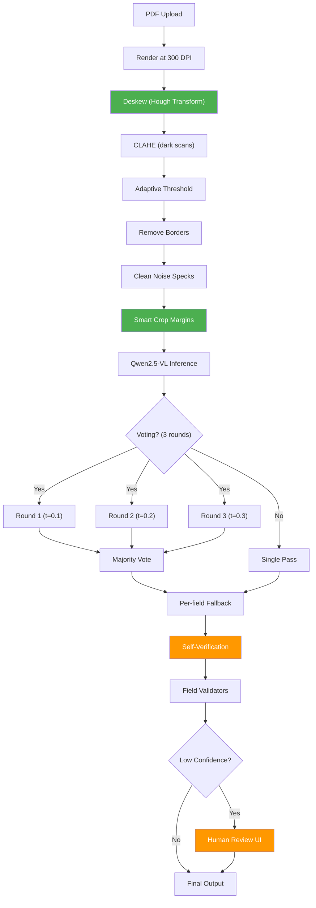

# Implementation Plan: All VLM Accuracy Gap Fixes

Every gap from the research, with exact file locations, root cause, and concrete solutions.

---

## Gap Overview

| #   | Gap                          | File                                                                                               | Impact                  | Effort   |
| --- | ---------------------------- | -------------------------------------------------------------------------------------------------- | ----------------------- | -------- |
| 1   | No deskewing                 | [image_enhancer.py](file:///e:/Dhairya/0_Projects/PDF%20AI/backend/utils/image_enhancer.py)        | +5% scans               | 1 hr     |
| 2   | No smart cropping            | [image_enhancer.py](file:///e:/Dhairya/0_Projects/PDF%20AI/backend/utils/image_enhancer.py)        | +3% all                 | 30 min   |
| 3   | DPI too high (400→300)       | [pdf_processor.py](file:///e:/Dhairya/0_Projects/PDF%20AI/backend/utils/pdf_processor.py)          | Faster, no loss         | 5 min    |
| 4   | No few-shot examples         | [qwen2vl_extractor.py](file:///e:/Dhairya/0_Projects/PDF%20AI/backend/models/qwen2vl_extractor.py) | +3–5% edges             | 15 min   |
| 5   | Fixed temperature in voting  | [qwen2vl_extractor.py](file:///e:/Dhairya/0_Projects/PDF%20AI/backend/models/qwen2vl_extractor.py) | +2% noisy               | 10 min   |
| 6   | No self-verification         | [qwen2vl_extractor.py](file:///e:/Dhairya/0_Projects/PDF%20AI/backend/models/qwen2vl_extractor.py) | +3% hallucinations      | 1 hr     |
| 7   | No constrained JSON decoding | [qwen2vl_extractor.py](file:///e:/Dhairya/0_Projects/PDF%20AI/backend/models/qwen2vl_extractor.py) | Eliminates parse errors | 1 day    |
| 8   | No fine-tuning               | New files                                                                                          | +10–15%                 | 1–2 days |
| 9   | No HITL review UI            | Frontend + backend                                                                                 | +3–5%                   | 2–3 days |

---

## Quick Wins (< 1 hour each)

---

### Gap 1: Deskewing

**Problem:** Scanned documents are often rotated 0.5–3°. The 14×14 patch grid in Qwen2.5-VL can't compensate for even small rotations — character boundaries split across patches, reducing OCR accuracy by 5–15%.

**Root cause:** [image_enhancer.py](file:///e:/Dhairya/0_Projects/PDF%20AI/backend/utils/image_enhancer.py) pipeline has no rotation correction.

**Solution:** Add `_deskew()` function before binarization in the [\_clean_document()](file:///e:/Dhairya/0_Projects/PDF%20AI/backend/utils/image_enhancer.py#84-136) pipeline.

**Where:** [image_enhancer.py L84–135](file:///e:/Dhairya/0_Projects/PDF%20AI/backend/utils/image_enhancer.py#L84-L135), insert after grayscale conversion (L101), before CLAHE (L103).

**Code:**

```python
def _deskew(gray: np.ndarray) -> np.ndarray:
    """
    Detect and correct document skew using Hough Line Transform.

    1. Detect edges with Canny
    2. Find lines with HoughLinesP
    3. Calculate median angle of detected lines
    4. Rotate image to correct skew (only if angle < 5°)
    """
    edges = cv2.Canny(gray, 50, 150, apertureSize=3)
    lines = cv2.HoughLinesP(edges, 1, np.pi/180, threshold=100,
                            minLineLength=100, maxLineGap=10)

    if lines is None:
        return gray  # No lines detected — skip

    # Calculate angles of all detected lines
    angles = []
    for line in lines:
        x1, y1, x2, y2 = line[0]
        angle = np.degrees(np.arctan2(y2 - y1, x2 - x1))
        # Only consider near-horizontal lines (within 15° of horizontal)
        if abs(angle) < 15:
            angles.append(angle)

    if not angles:
        return gray  # No near-horizontal lines

    # Median angle is more robust than mean (ignores outliers)
    median_angle = np.median(angles)

    # Only correct if skew is > 0.3° and < 5° (avoid false corrections)
    if abs(median_angle) < 0.3 or abs(median_angle) > 5.0:
        return gray

    print(f"       ✅ Deskew: correcting {median_angle:.1f}° rotation")

    # Rotate around center
    h, w = gray.shape[:2]
    center = (w // 2, h // 2)
    M = cv2.getRotationMatrix2D(center, median_angle, 1.0)
    rotated = cv2.warpAffine(gray, M, (w, h),
                              flags=cv2.INTER_LINEAR,
                              borderMode=cv2.BORDER_CONSTANT,
                              borderValue=255)  # White fill for borders
    return rotated
```

**Integration in [\_clean_document()](file:///e:/Dhairya/0_Projects/PDF%20AI/backend/utils/image_enhancer.py#84-136):**

```diff
 gray = cv2.cvtColor(img_np, cv2.COLOR_RGB2GRAY)

+# ── Step 0: Deskew (correct scan rotation) ──
+gray = _deskew(gray)
+
 # ── Step 1: CLAHE for dark scans ──
```

---

### Gap 2: Smart Cropping (Trim Empty Margins)

**Problem:** Many PDF pages have large white margins (1–2 inches). At 400 DPI, these margins consume ~20–30% of the pixel budget. The VLM's `smart_resize()` then downscales the _entire_ image to fit within [max_pixels](file:///e:/Dhairya/0_Projects/PDF%20AI/backend/config.py#59-78), meaning actual content gets fewer pixels.

**Root cause:** [image_enhancer.py](file:///e:/Dhairya/0_Projects/PDF%20AI/backend/utils/image_enhancer.py) has no margin trimming.

**Solution:** Add `_smart_crop()` as the LAST step in the pipeline (after binarization + border removal), to trim white margins while keeping a small padding.

**Where:** [image_enhancer.py L134](file:///e:/Dhairya/0_Projects/PDF%20AI/backend/utils/image_enhancer.py#L134), after `cv2.morphologyEx` and before `cv2.cvtColor(binary, ...)`.

**Code:**

```python
def _smart_crop(binary: np.ndarray, padding: int = 20) -> np.ndarray:
    """
    Trim white margins from binarized document.

    Finds the bounding box of all non-white (text) content,
    then crops with padding to preserve document edges.

    Args:
        binary: Binary image (white bg, black text)
        padding: Pixels of white space to preserve around content

    Returns:
        Cropped binary image
    """
    # Invert so text is white (foreground)
    inverted = cv2.bitwise_not(binary)

    # Find all non-zero (text) pixel coordinates
    coords = cv2.findNonZero(inverted)

    if coords is None:
        return binary  # Entirely blank page

    # Get bounding rectangle of all text content
    x, y, w, h = cv2.boundingRect(coords)

    # Add padding (clamped to image boundaries)
    img_h, img_w = binary.shape[:2]
    x1 = max(0, x - padding)
    y1 = max(0, y - padding)
    x2 = min(img_w, x + w + padding)
    y2 = min(img_h, y + h + padding)

    # Only crop if we'd remove meaningful margin (> 5% of dimension)
    margin_ratio = 1.0 - ((x2 - x1) * (y2 - y1)) / (img_w * img_h)
    if margin_ratio < 0.05:
        return binary  # Margins too small to bother

    print(f"       ✅ Smart crop: removed {margin_ratio:.0%} empty margins")
    return binary[y1:y2, x1:x2]
```

**Integration:**

```diff
 # ── Step 5: Clean isolated noise specks ──
 clean_kernel = cv2.getStructuringElement(cv2.MORPH_ELLIPSE, (2, 2))
 binary = cv2.morphologyEx(binary, cv2.MORPH_OPEN, clean_kernel)

+# ── Step 6: Smart crop (trim white margins) ──
+binary = _smart_crop(binary)
+
 # Convert back to RGB
```

---

### Gap 3: DPI Optimization (400 → 300)

**Problem:** We render PDFs at 400 DPI, producing images of ~1.9M pixels. But our pixel budget is `max_pixels = 1,317,120` (~1.3M). The processor's `smart_resize()` then **downscales** the image — wasting the rendering effort AND introducing resampling artifacts.

**Root cause:** [pdf_processor.py L14](file:///e:/Dhairya/0_Projects/PDF%20AI/backend/utils/pdf_processor.py#L14) sets `DPI = 400`.

**Solution:** Change to 300 DPI. An A4 page at 300 DPI = 2480×3508 = 8.7M pixels → after smart_resize, fits well within 1.3M budget. Same quality, less downscaling distortion, faster rendering.

> [!IMPORTANT]
> After implementing **Gap 2** (smart cropping), the effective image is even smaller, making 300 DPI the sweet spot.

**Code change:**

```diff
 # Render DPI for PDF → Image conversion
-DPI = 400
+DPI = 300
```

**Why not lower?** Below 300 DPI, small text (8pt and below) starts losing clarity. 300 DPI is the industry standard for document OCR.

---

### Gap 4: Few-Shot Examples in Prompts

**Problem:** The batch extraction prompt tells the model WHAT to extract but never shows HOW a correct output looks. Few-shot prompting has been shown to improve structured output accuracy by 3–5%.

**Root cause:** [qwen2vl_extractor.py L456–464](file:///e:/Dhairya/0_Projects/PDF%20AI/backend/models/qwen2vl_extractor.py#L456-L464) — user prompt has instructions but no example.

**Solution:** Add a generic few-shot example at the end of the user prompt.

**Code change in [\_extract_batch_json()](file:///e:/Dhairya/0_Projects/PDF%20AI/backend/models/qwen2vl_extractor.py#433-523):**

```diff
 user_prompt = (
     f"Extract these fields from the document image and return as JSON: {field_list}. "
     f"Return a JSON object with exactly these keys. "
     f"For each field, find the matching label in the document and copy its value exactly as written. "
     f"Include complete multi-line values (e.g. full addresses with city, state, zip). "
-    f"If a field is not found, set its value to empty string."
+    f"If a field is not found, set its value to empty string.\n\n"
+    f"Example output format:\n"
+    f'{{"Patient Name": "DOE, JOHN", "DOB": "01/15/1980", "Address": "123 MAIN ST, SPRINGFIELD, IL 62701"}}\n\n'
+    f"Now extract from this document:"
 )
```

> [!NOTE]
> The example uses generic field names. Since the actual field names vary per user preset, this example just shows the FORMAT. The model learns: "output clean JSON with quoted string values."

---

### Gap 5: Temperature Variation in Voting Rounds

**Problem:** All 3 voting rounds use `temperature=0.1`. This makes the model produce nearly identical outputs each time — defeating the purpose of voting (which relies on diversity to catch errors).

**Root cause:** [qwen2vl_extractor.py L500-501](file:///e:/Dhairya/0_Projects/PDF%20AI/backend/models/qwen2vl_extractor.py#L500-L501) — hardcoded `temperature=0.1`.

**Solution:** Pass temperature as a parameter. During voting, vary it across rounds: `[0.1, 0.2, 0.3]`.

**Code changes:**

1. Add `temperature` parameter to [\_extract_batch_json()](file:///e:/Dhairya/0_Projects/PDF%20AI/backend/models/qwen2vl_extractor.py#433-523):

```diff
 def _extract_batch_json(
-    self, image: Image.Image, fields: List[str]
+    self, image: Image.Image, fields: List[str], temperature: float = 0.1
 ) -> Dict[str, str]:
```

2. Use it in the generate call:

```diff
     outputs = self.model.generate(
         **inputs,
         max_new_tokens=1024,
         do_sample=True,
-        temperature=0.1,
+        temperature=temperature,
         top_p=0.9,
     )
```

3. In the voting loop in [extract()](file:///e:/Dhairya/0_Projects/PDF%20AI/backend/models/qwen2vl_extractor.py#269-359), vary temperature:

```diff
+VOTING_TEMPERATURES = [0.1, 0.2, 0.3]

 for round_num in range(voting_rounds):
     print(f"   ── Round {round_num + 1}/{voting_rounds} ──")
-    round_results = self._extract_batch_json(image, fields)
+    temp = VOTING_TEMPERATURES[round_num % len(VOTING_TEMPERATURES)]
+    print(f"      Temperature: {temp}")
+    round_results = self._extract_batch_json(image, fields, temperature=temp)
```

---

## Medium-Term (1 hour – 1 day each)

---

### Gap 6: Self-Verification Pass

**Problem:** VLMs can hallucinate — generating plausible but wrong field values. The current hallucination guard only catches long/sentence-like answers, not short incorrect values (e.g., reading "PATRICIA" as "PATRICK").

**Root cause:** No post-extraction verification exists. The pipeline trusts whatever the model returns.

**Solution:** Add a verification step that asks the model to confirm critical fields.

**Where:** [qwen2vl_extractor.py](file:///e:/Dhairya/0_Projects/PDF%20AI/backend/models/qwen2vl_extractor.py) — new method `_verify_field()`, called after the final results in [extract()](file:///e:/Dhairya/0_Projects/PDF%20AI/backend/models/qwen2vl_extractor.py#269-359).

**Code:**

```python
def _verify_field(self, image: Image.Image, field: str, value: str) -> bool:
    """
    Ask the model to verify: 'Is this value correct for this field?'
    Returns True if the model confirms, False if it disagrees.
    """
    system_prompt = (
        "You are a document verification engine. "
        "Given a document image, a field name, and a proposed value, "
        "verify whether the value is accurately extracted. "
        "Respond with ONLY 'YES' or 'NO'."
    )

    user_prompt = (
        f'Verify: In this document, is the value of "{field}" '
        f'equal to "{value}"? '
        f'Check the document carefully. Answer YES or NO only.'
    )

    messages = [
        {"role": "system", "content": system_prompt},
        {"role": "user", "content": [
            {"type": "image", "image": image},
            {"type": "text", "text": user_prompt},
        ]}
    ]

    # ... (same generate pattern as _extract_single_field)
    # Parse response for YES/NO
    response = output_text.strip().upper()
    return response.startswith("YES")
```

**Integration in [extract()](file:///e:/Dhairya/0_Projects/PDF%20AI/backend/models/qwen2vl_extractor.py#269-359):**

```python
# ── Step 3: Self-verification for low-confidence fields ──
low_conf_fields = [
    f for f in fields
    if all_results[f].strip()
    and self._last_confidences.get(f, 0) < 0.80
]

if low_conf_fields:
    print(f"\n   🔍 Step 3: Verifying {len(low_conf_fields)} low-confidence fields")
    for field in low_conf_fields:
        value = all_results[field]
        verified = self._verify_field(image, field, value)
        if not verified:
            print(f"      ❌ Verification failed: '{field}' = '{value}' — clearing")
            all_results[field] = ""
            self._last_confidences[field] = 0.0
        else:
            print(f"      ✅ Verified: '{field}' = '{value}'")
            self._last_confidences[field] = min(self._last_confidences[field] + 0.1, 0.95)
```

> [!WARNING]
> Self-verification adds 1 inference call per low-confidence field. With voting, most fields will be high-confidence, so only 1–3 fields typically need verification.

---

### Gap 7: Constrained JSON Decoding

**Problem:** The model sometimes returns invalid JSON (missing quotes, trailing commas, markdown fencing). The [\_parse_json_output()](file:///e:/Dhairya/0_Projects/PDF%20AI/backend/models/qwen2vl_extractor.py#882-943) method handles this with regex cleanup, but edge cases still fail.

**Root cause:** Model generation is unconstrained — it can output any tokens, not just valid JSON.

**Solution:** Use the `outlines` library for grammar-constrained generation. Outlines masks invalid tokens during decoding, guaranteeing structurally valid JSON.

**Approach:**

```python
# Install: pip install outlines
import outlines

# Create a JSON schema from the field list
schema = {
    "type": "object",
    "properties": {f: {"type": "string"} for f in fields},
    "required": fields,
}

# Use outlines to create a constrained generator
generator = outlines.generate.json(model, schema)
result = generator(prompt, image)
# result is ALWAYS valid JSON matching the schema
```

> [!IMPORTANT]
> `outlines` requires integration with the model's generation pipeline. This is a deeper change — it replaces the `model.generate()` + [\_parse_json_output()](file:///e:/Dhairya/0_Projects/PDF%20AI/backend/models/qwen2vl_extractor.py#882-943) pattern entirely. Test carefully before shipping.

**Alternative (lighter):** Use a JSON repair library (`json-repair` package) as a post-processing step instead of constrained decoding. Less guaranteed but much easier to add:

```python
# pip install json-repair
import json_repair
repaired = json_repair.loads(output_text)
```

---

## Long-Term (1–3 days each)

---

### Gap 8: Fine-Tuning with LoRA

**Problem:** Our model (Qwen2.5-VL-3B) is a general-purpose VLM. It's never seen documents exactly like ours. Fine-tuning on 50–200 domain-specific documents is the **single largest accuracy improvement** possible.

**Root cause:** No training data prepared, no fine-tuning pipeline set up.

**Solution path:**

#### Step 1: Collect Training Data

- Extract 50–200 sample documents from real usage
- Manually annotate ground truth for each field
- Format as JSONL:

```jsonl
{
  "image": "path/to/doc001.png",
  "conversations": [
    {
      "role": "system",
      "content": "You are a high-precision form field extraction engine..."
    },
    {
      "role": "user",
      "content": [
        {
          "type": "image",
          "image": "path/to/doc001.png"
        },
        {
          "type": "text",
          "text": "Extract: Patient Name, DOB, ..."
        }
      ]
    },
    {
      "role": "assistant",
      "content": "{\"Patient Name\": \"DOE, JOHN\", \"DOB\": \"01/15/1980\"}"
    }
  ]
}
```

#### Step 2: Set Up Training

```bash
pip install peft trl accelerate bitsandbytes
```

Key training config:

- **Method:** QLoRA (4-bit quantized LoRA)
- **LoRA rank:** 16
- **Learning rate:** 2e-5
- **Epochs:** 3–5
- **Trainable parameters:** ~0.5% of model

#### Step 3: Training Script

```python
from peft import LoraConfig, get_peft_model
from transformers import Qwen2VLForConditionalGeneration

model = Qwen2VLForConditionalGeneration.from_pretrained(
    "Qwen/Qwen2.5-VL-3B-Instruct",
    load_in_4bit=True,
)

lora_config = LoraConfig(
    r=16,
    lora_alpha=32,
    target_modules=["q_proj", "v_proj", "k_proj", "o_proj"],
    lora_dropout=0.05,
    task_type="CAUSAL_LM",
)

model = get_peft_model(model, lora_config)
# ... train with TRL SFTTrainer
```

#### Step 4: Deploy

```python
# In config.py, add:
QWEN2VL_LORA_PATH = "path/to/trained/lora/adapter"

# In qwen2vl_extractor.py, load adapter:
from peft import PeftModel
model = PeftModel.from_pretrained(base_model, QWEN2VL_LORA_PATH)
```

**Expected impact:** +10–15% accuracy across all document types.

---

### Gap 9: HITL (Human-in-the-Loop) Review UI

**Problem:** Even with fine-tuning, 100% accuracy is impossible. Low-confidence fields need human review. The current system has [\_last_meta](file:///e:/Dhairya/0_Projects/PDF%20AI/backend/models/qwen2vl_extractor.py#596-599) with confidence scores but no UI for review.

**Root cause:** No frontend review interface exists.

**Solution path:**

#### Backend Changes

[server.py](file:///e:/Dhairya/0_Projects/PDF%20AI/backend/server.py):

- Return confidence scores and validation metadata with extraction results
- Add new endpoint: `POST /api/review` to accept human corrections
- Store corrections for future fine-tuning data

```python
@app.post("/api/extract")
async def extract_fields(...):
    # ... existing extraction ...

    return {
        "fields": results,
        "metadata": {
            "confidences": extractor._last_meta["confidences"],
            "validation": extractor._last_meta["validation"],
            "needs_review": [
                f for f, c in extractor._last_meta["confidences"].items()
                if c < 0.80
            ],
        }
    }
```

#### Frontend Changes

[src/index.js](file:///e:/Dhairya/0_Projects/PDF%20AI/src/index.js):

- Color-code fields by confidence (green > 0.90, yellow 0.70–0.90, red < 0.70)
- Add inline edit capability for flagged fields
- Track corrections made by the user

```
┌──────────────────────────────────────┐
│  Patient Name: DOE, JOHN       ✅ 92% │
│  DOB: 01/15/1980               ✅ 90% │
│  Patient Address: [empty]      ❌ 0%  │ ← click to manually enter
│  Insurance: BLUE CROSS         ⚠️ 75% │ ← yellow, editable
└──────────────────────────────────────┘
```

---

## Complete Pipeline After All Fixes



---

## Verification Plan

### Per-Gap Testing

| Gap             | Test Method                                                                 |
| --------------- | --------------------------------------------------------------------------- |
| 1 (Deskew)      | Manually rotate ORDR PDF by 2°, run extraction, compare with/without deskew |
| 2 (Crop)        | Check pixel count before/after crop, verify text content preserved          |
| 3 (DPI)         | Compare extraction results at 300 vs 400 DPI on both ORDR and CPL           |
| 4 (Few-shot)    | A/B test: run extraction with and without example, compare accuracy         |
| 5 (Temperature) | Run voting 10 times, check if varied temp produces more diverse answers     |
| 6 (Verify)      | Inject a wrong value, confirm verification catches it                       |
| 7 (JSON)        | Test with documents that previously caused JSON parse failures              |
| 8 (LoRA)        | Compare accuracy on held-out test set: before vs after fine-tuning          |
| 9 (HITL)        | Manual browser test: verify confidence colors and edit functionality        |
